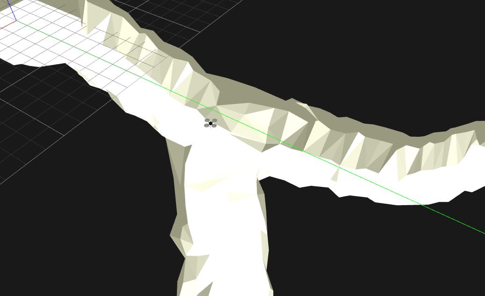
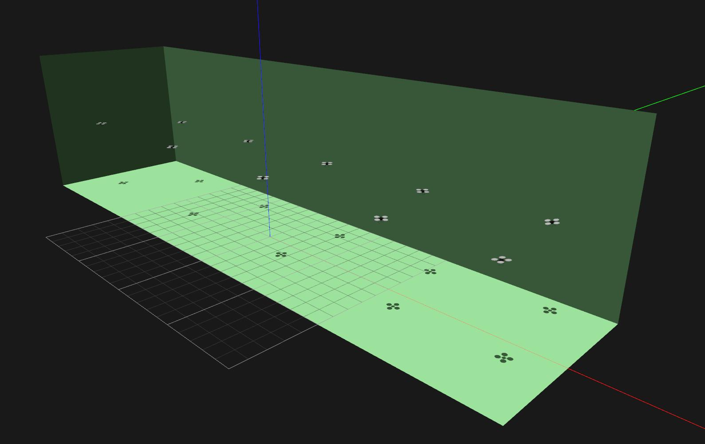

# What is this?
UAV tunnel navigation control, running on ROS. Ad hoc network and enclosed environments for Gazebo are included.

---

# Environments
## Y-tunnel

A tunnel with two branches. It was manually modeled by using Blender.

## Indian Tunnel

The Indian lava tube, based on [the ranging sensor data provided by CMU](http://www.frc.ri.cmu.edu/projects/NIAC_Caves/). The details of generation of this 3D model can be found here:
https://github.com/tidota/poisson-sampling

---

# Navigation Algorithms/Code
## Reactive Agent
The program is composed of several nodes each of which represent a node to take care of a specific behavior.
Every node takes the same sensory data and makes its own decision or control outputs (geometry_msgs/Twist).
They are connected with each other by ROS topics, consisting a tree.
All messages generated by them go toward to the root node: main_control, which finally generates /cmd_vel.

A node has two options to generate its output: combine and pass the control values given by the other nodes toward the root, or block them and pass its own.
When specific conditions to its corresponding behavior are satisfied, it blocks the messages from the other nodes and passes its own toward the root.
Otherwise, it combines and passes the control values generated by the others.
This mechanism lets a specific behavior appear only in its assumed situation. For example, the node, altitude_adjustment, connects to the one, obstacle_avoidance. The obstacle_avoidance node passes the message from others only if there is no impending obstacles to avoid immediately; the altitude_adjustment node can generate its behavior without impending obstacles.

At the moment (as of Dec 25, 2017), it contains six nodes.
- **obstacle_avoidance**: avoids impending obstacles, assumes nothing.
- **altitude_adjustment**: keeps the altitude in the middle of the vertical line, assumes that there is no impending obstacles.
- **turning_around**: turns the robot around so that it can avoid the wall in front of it.
- **steering**: adjusts the heading so that the robot's right side faces toward the wall.
- **staying_on_the_middle_line**: adjusts the horizontal position in the tube.
- **going_straight**: moves the robot forward.


## SLAM

Currently working on implementation of SLAM.

_TODO_:
- OctoMap
- Localization

---

# Setup

This package should run in the following environments.

As of October 14, 2018, the second one is experimental.
<!--The second one is up-to-date and recommended.-->

1. Ubuntu16.04 (Xenial)
    - ROS: Kinetic
    - Gazebo: Gazebo7
1. Ubuntu18.04 (Bionic)
    - ROS: Melodic
    - Gazebo: Gazebo9

##  OS: Ubuntu 16.04, ROS: Kinetic, Gazebo7

This package requires [hector-quadrotor packages](https://github.com/tu-darmstadt-ros-pkg/hector_quadrotor). Check [the details](SETUP.md).

### Installation of this package
```
cd ~/catkin/src
git clone --branch gazebo7 git@github.com:tidota/quadrotor-tunnel-nav.git
cd ..
catkin_make
```

## OS: Ubuntu18.04, ROS: Melodic, Gazebo9

If you do not have wstool,
```
sudo apt-get install python-wstool
```

Assume you are in the catkin workspace.

Make a `src` directory if you do not have it yet.
```
mkdir src
```

In the `src`, make or download [quadrotor_tunnel_nav.rosinstall](https://raw.githubusercontent.com/tidota/quadrotor-tunnel-nav/master/quadrotor_tunnel_nav.rosinstall) containing the following
```
- git: {local-name: hector_quadrotor, uri: 'https://github.com/tu-darmstadt-ros-pkg/hector_quadrotor.git', version: kinetic-devel}
- git: {local-name: hector_localization, uri: 'https://github.com/tu-darmstadt-ros-pkg/hector_localization.git', version: catkin}
- git: {local-name: hector_gazebo, uri: 'https://github.com/tu-darmstadt-ros-pkg/hector_gazebo.git', version: kinetic-devel}
- git: {local-name: hector_models, uri: 'https://github.com/tu-darmstadt-ros-pkg/hector_models.git', version: kinetic-devel}
- git: {local-name: hector_slam, uri: 'https://github.com/tu-darmstadt-ros-pkg/hector_slam.git', version: catkin}
- git: {local-name: quadrotor-tunnel-nav, uri: 'https://github.com/tidota/quadrotor-tunnel-nav.git', version: master}
```

Finally, run the following commands.
```
wstool init src ./src/quadrotor_tunnel_nav.rosinstall
wstool update -t src
rosdep install --from-paths src --ignore-src --rosdistro=melodic -y
```

---

# How to run
You need to launch two parts in separated terminal windows: Gazebo (simulation environment) and controller.

## Gazebo:

Y-tunnel
```
roslaunch quadrotor_tunnel_nav uav_Y-tunnel.launch
```
Indian Tunnel
```
roslaunch quadrotor_tunnel_nav uav_IndianTunnel.launch
```

## Controller:
The hector-quadrotor (built from the source) apparently [disables the motors in default](https://answers.ros.org/question/256590/hector-quadcopter-not-responding-to-cmd_vel-messages/) and it is required to enable them.
```
rosservice call /enable_motors true
roslaunch quadrotor_tunnel_nav control.launch
```
Then, you can see a quadrotor flying inside a tunnel in the simulator window.

---

# Ad Hoc Network



This package also simulates Ad Hoc network composed of multiple UAVs based on [AllNet](http://alnt.org/). Please note that it will require high machine power. A desktop PC or workstation is recommended.
This part of the package was tested and used on HP Z620.

In a rectangular space, 10 UAVs fly around by the similar reactive controller mentioned above. The configuration of robot formation and network is defined in `config/adhoc/robots.yaml` and `config/adhoc/simconfig.yaml`.

The communication is managed by a world plugin `AdHocNetPlugin` and a model plugin `AdHocClientPlugin`. The model plugin is applied to each robot and communicates with the world plugin. The world plugin checks the robot's location and determines to pass a packet based on the communication range.

As of October 10, 2018, they are just broadcasting packets, but epidemic routing will be implemented in the future.

---
Before running the simulation, the following command must run so that multiple nodes can open sockets to communicate with each other.
```
ulimit -n 9000
```

If this does not work, [this page](https://superuser.com/questions/1200539/cannot-increase-open-file-limit-past-4096-ubuntu) may work.
In `/etc/systemd/user.conf` and `/etc/systemd/system.conf`, edit the line of `#DefaultLimitNOFILE=` like this
```
DefaultLimitNOFILE=9000
```
And in `/etc/security/limits.conf`, add the following lines
```
<Your user ID> hard nofile 9000
<Your user ID> soft nofile 9000
```
---

Then, in your catkin workspace, build the program and run it as follows.

```
. /opt/ros/kinetic/setup.bash
catkin_make
. devel/setup.bash
roslaunch quadrotor_tunnel_nav I-tunnel-40x10.launch
```

The results are stored in csv files under `~/.ros/`

When you restart the simulation more than once, you had better to remove old
results, including ROS's log files.
```
rm ~/.ros/*.csv
rosclean purge
```

---

# Memorandum
[Misc notes of ROS commands](MEMORANDUM.md)
